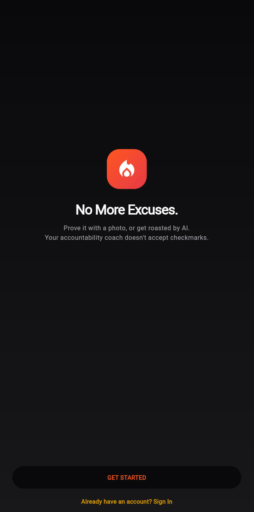

# 🔥 Tough Love — Habit Tracker with Real Stakes

> *Your habits. Your proof. Your roast.*

Tough Love creates real stakes for your daily habits by pairing **strict photographic verification** with **highly personalized, AI-driven feedback**. Miss your deadline and your chosen persona won't let you forget it.

---

## 🧠 Concept

Users select an AI "persona" to act as their coach — options range from an **Angry Drill Sergeant** or **Sarcastic Best Friend** to a **Hype Coach**. When it's time to check in, users must provide **photographic proof** of habit completion. The AI evaluates the submission in real time:

- ✅ Valid proof → streak stays alive
- ❌ Missed deadline → persona sends a personalized roast push notification + streak resets to zero

---

## ⚙️ How It Works

The architecture uses a cross-platform Flutter frontend backed by serverless infrastructure and a multi-model AI pipeline.

### 📱 Mobile Frontend — Flutter
- Built with **Flutter** and **Riverpod** for reactive state management
- Handles onboarding, persona selection, and photo capture

### 🖼️ Multimodal Validation — Gemini AI
- Check-ins are evaluated using **GPT-4o**
- The model analyzes the uploaded image against the user's specific habit to determine if it objectively counts as proof

### ☁️ Serverless Escalation Engine — Node.js & Firebase
A **Firebase Cloud Functions** backend runs an hourly cron-based "Roast Scheduler" with two phases:

| Phase | Trigger | Action |
|---|---|---|
| ⚠️ Warning | Near deadline, no approved check-in | **GPT-4o** generates a persona-specific warning → sent via Firebase Cloud Messaging |
| 🔥 Theatrical Roast | Deadline passed, no proof | Streak resets to zero + AI-generated high-intensity roast delivered |

### 🔒 Extreme Data Minimization
Privacy is core to the architecture — photos and location coordinates are used **strictly for AI validation and never stored**:

1. **Client-side deletion** — immediately after evaluation
2. **`finally` block cleanup** — cleared in cloud functions regardless of outcome
3. **Background cron sweep** — active cleanup job guarantees zero data retention

---

## 🛠️ Tech Stack

| Layer | Technology |
|---|---|
| Mobile | Flutter, Riverpod |
| Image Validation | Google Gemini 1.5 Flash-8B |
| Backend | Firebase Cloud Functions (Node.js) |
| Push Notifications | Firebase Cloud Messaging |
| Roast Generation | OpenAI GPT-4o |

---

## ⚠️ Repository Notice

> **This repository does not contain the full project source.**

The complete codebase is kept private for personal development.

What is included here serves as a **portfolio reference and architectural overview** only.

---

## 📁 Project Structure

```
tough-love/
├── lib/                    # Flutter app source
│   ├── screens/            # UI screens (onboarding, check-in, etc.)
│   ├── providers/          # Riverpod state management
│   └── models/             # Data models
├── functions/              # Firebase Cloud Functions (Node.js)
│   ├── roastScheduler.js   # Hourly cron job
│   ├── validateCheckIn.js  # Gemini AI validation
│   └── cleanup.js          # Data minimization sweep
├── assets/                 # App assets
└── README.md
```

> 📝 **Note:** Sections marked with `# TODO` or `<!-- ADD: -->` are placeholders for future additions.

---

## 🚀 Personas Available

- 😤 Angry Drill Sergeant
- 😏 Sarcastic Best Friend
- 🎉 Hype Coach
- *(more can be added — see `/lib/models/personas.dart`)*

---

## 📌 Future Additions



---

*Built for personal use.*
