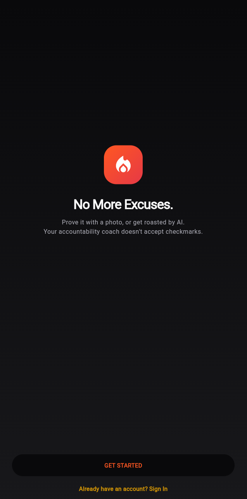

# 🏋️ Tough Love — AI Accountability Coach

> ⚠️ **STATUS: WORK IN PROGRESS / IN DEVELOPMENT**  
> **This application is unfinished and currently under active development.** Core features, backend services, and UI components are functional, but store compliance assets, binary signing keystores, and final production distribution setups are still being finalized.

---

## 📖 What This App Does

**Tough Love** is an AI-powered accountability and habit-tracking application designed to eliminate self-cheating. Traditional habit trackers rely on honour-system checkmarks; **Tough Love** requires concrete proof (such as photo check-ins) verified by an LLM-driven AI Coach.

### Key Features

* 🤖 **AI Accountability Coach**: Evaluates check-in proof in real-time using generative AI. If you fail or miss deadlines, the AI delivers custom roasts according to your selected persona and intensity.
* 🎭 **Dynamic AI Personas**: Choose your preferred accountability style:
  * **Angry Drill Sergeant** (High intensity, strict enforcement)
  * **Sarcastic Best Friend** (Witty, sarcastic call-outs)
  * **Zen Master** (Mindful, calm guidance)
  * **Hype Coach** (High energy, encouraging motivation)
* 🔥 **Streak & Gamification Economy**: Earn points for completing habits, maintain streaks, build strike protections, and submit AI-adjudicated leave/vacation requests when needed.
* 🏆 **Global Leaderboards & Squads**: 
  * Live Top 50 global ranking powered by aggregate Firestore counters.
  * Squad dashboard for up to 4 accountability partners to track group progress.
* 👥 **Infinite Friend Network**: Alphanumeric UUID system for connecting with friends via parallel atomic Firestore batch writes.
* 🔒 **Extreme Data Minimization Protocol**: Privacy-first media processing. Verification photos and sensitive data are processed by the AI and immediately purged—never permanently stored.
* 🎨 **Multi-Theme UI**: Modern glassmorphism interface featuring dynamic theme switching (Default Zinc Slate, Dark Energy OLED Black, and Crisp Light Onyx).

---

## 🛠️ How It Was Built

### Frontend Engine (Mobile App)
* **Framework**: [Flutter](https://flutter.dev/) (Dart SDK `>=3.6.0`)
* **State Management**: [Riverpod](https://riverpod.dev/) (`flutter_riverpod` with `NotifierProvider` and reactive `StreamProviders`)
* **Routing**: [GoRouter](https://pub.dev/packages/go_router) using `StatefulShellRoute` for persistent bottom navigation state
* **UI & Theming**: Custom Design System utilizing Flutter `ThemeExtension` (`AppThemeColors`) with glassmorphic cards and micro-animations
* **Device Capabilities**: Integrated support for Camera (`camera`), HealthKit / Health Connect (`health`), background location (`flutter_background_geolocation`), and screen usage stats (`app_usage`, `usage_stats`)

### Backend & Cloud Infrastructure
* **Backend Platform**: [Firebase Ecosystem](https://firebase.google.com/)
  * **Firebase Auth**: Email/Password + Google & Apple OAuth
  * **Cloud Firestore**: Real-time NoSQL document database with aggregate counters
  * **Cloud Functions**: Node.js / TypeScript microservices for AI evaluation and scheduled background crons
  * **Cloud Storage**: Temporary staging bucket for check-in proof media
* **Telemetry & Security**: `firebase_crashlytics` and `firebase_analytics` with environment directives isolating release environments and ProGuard/R8 obfuscation.

### AI Engine
* **Model**: [Google Gemini AI API](https://ai.google.dev/) (`google_generative_ai` & Cloud Functions Gemini integration) for multi-modal image evaluation, habit verification, and contextual persona roasting.

---

## ⚙️ How It Works

```
┌─────────────────┐       ┌─────────────────┐       ┌─────────────────┐
│                 │       │  Temporary      │       │ Cloud Function  │
│  Flutter Client │ ────> │  Cloud Storage  │ ────> │ + Gemini AI API │
│  (Photo Proof)  │       │  (Staging)      │       │ (Evaluation)    │
└─────────────────┘       └─────────────────┘       └─────────────────┘
         │                                                   │
         │                                                   │
         ▼                                                   ▼
┌─────────────────┐                                 ┌─────────────────┐
│ Instant Storage │ <────────────────────────────── │ AI Verdict &    │
│  Purge (Client) │                                 │ Points/Roast    │
└─────────────────┘                                 └─────────────────┘
                                                             │
                                                             ▼
                                                    ┌─────────────────┐
                                                    │ Cloud Firestore │
                                                    │ (Logs & Ranks)  │
                                                    └─────────────────┘
```

1. **Habit Creation & Scheduling**:
   * Users define custom habit schedules (frequency, deadline times, target proof requirements).
2. **Check-in & Verification**:
   * To complete a habit, the user snaps a photo check-in or submits progress text.
   * The proof is uploaded to a temporary Firebase Storage bucket.
3. **AI Evaluation & Roasting**:
   * A Firebase Cloud Function sends the image payload to Gemini AI alongside the user's selected coach persona and roast intensity level.
   * The AI returns a verdict (Pass/Fail), awards or deducts economy points, and generates personalized feedback/roasts.
4. **Data Minimization & Automated Cleanup**:
   * **Layer 1**: Client application deletes the photo from Storage immediately after receiving the AI verdict.
   * **Layer 2**: Cloud Function `finally` blocks enforce deletion even if an error occurs.
   * **Layer 3**: Hourly backend cron jobs purge any residual orphaned media older than 60 seconds.
5. **Real-time Leaderboard & Social Syncing**:
   * Points and logs update in Firestore. Live streams refresh global ranks and squad dashboards instantaneously.

---

## 🚧 Current Development Status

The codebase is currently in active development.

- [x] Core Flutter state management architecture (Riverpod + GoRouter)
- [x] Firebase Authentication (Email, Google Sign-in)
- [x] Firestore database models & multi-theme UI engine
- [x] Gemini AI integration & backend Cloud Functions
- [x] Squads & Global Leaderboards
- [x] Automated photo deletion & data minimization pipeline
- [ ] Final launcher icons & native splash screen assets (`flutter_launcher_icons`, `flutter_native_splash`)
- [ ] Production Android Release Keystore generation (`.aab` build)
- [ ] Apple Developer Provisioning Profiles & Store Compliance documentation
- [ ] Automated end-to-end integration test suite

---

## 🚀 Personas Available

- 😤 Angry Drill Sergeant
- 😏 Sarcastic Best Friend
- 🎉 Hype Coach
- *(more can be added — see `/lib/models/personas.dart`)*

---

## 📌 Loading Screen Screenshot



---

## 📄 License

*Internal Development / Proprietary.*
